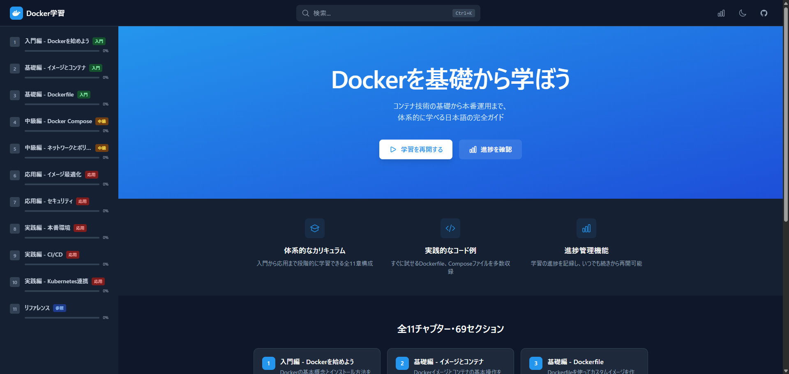

# Docker Tutorial Website

Dockerを基礎から学べるインタラクティブな学習サイトです。

## スクリーンショット



## デモ

実際のサイトはこちらで確認できます（デプロイ後にURLを追加）

## 特徴

- **11章構成の体系的なカリキュラム** - Docker基礎からKubernetes連携まで
- **インタラクティブな学習体験**
  - 進捗トラッキング（LocalStorage保存）
  - ブックマーク機能
  - 確認クイズ
  - 学習統計（連続学習日数、完了数など）
- **使いやすいUI**
  - ダークモード対応
  - レスポンシブデザイン
  - ファジー検索（Ctrl+K）
  - 目次ナビゲーション
- **セキュリティ対策済み**
  - XSS対策（rehype-sanitize）
  - 入力値検証
  - パストラバーサル対策

## 技術スタック

| カテゴリ | 技術 |
|---------|------|
| フレームワーク | React 18 + TypeScript |
| ビルドツール | Vite |
| スタイリング | Tailwind CSS |
| 状態管理 | Zustand (persist) |
| ルーティング | React Router v6 |
| Markdown | react-markdown + rehype |
| 検索 | Fuse.js |
| テスト | Vitest + Testing Library |

## カリキュラム

1. **Docker入門** - コンテナ技術の基礎
2. **コンテナ操作** - 基本コマンドとライフサイクル
3. **Dockerfile** - イメージのビルド
4. **Docker Compose** - マルチコンテナ管理
5. **ネットワーク** - コンテナ間通信
6. **ボリューム・データ管理** - 永続化
7. **セキュリティ** - ベストプラクティス
8. **本番環境** - デプロイメント戦略
9. **CI/CD** - 継続的インテグレーション
10. **Kubernetes連携** - オーケストレーション
11. **リファレンス** - コマンド集・チートシート

## セットアップ

```bash
# 依存関係のインストール
npm install

# 開発サーバー起動
npm run dev

# ビルド
npm run build

# テスト実行
npm test

# カバレッジ付きテスト
npm run test:coverage
```

## テストカバレッジ

| 指標 | カバレッジ |
|------|-----------|
| Statements | 92.59% |
| Branches | 84.26% |
| Functions | 97.4% |
| Lines | 94.06% |

## ライセンス

MIT License

## 作者

Created with Claude Code
